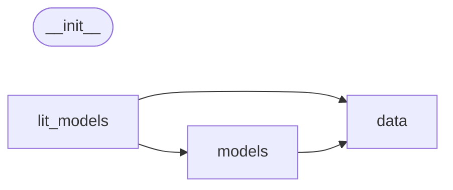

# Code Overview

[_Documentation generated by Documatic_](https://www.documatic.com)

<!---Documatic-section-Codebase Structure Python-start--->
## Codebase Structure Python

The codebase has a single-depth folder structure,
                with 12 code files in total.

<!---Documatic-block-system_architecture-start--->

<!---Documatic-block-system_architecture-end--->

# #
<!---Documatic-section-Codebase Structure Python-end--->

<!---Documatic-section-Important Functions-start--->
## Important Functions

<!---Documatic-block-important_funcs-start--->
<!---Documatic-block-most_used_funcs-start--->
### Most Utilised Functions

* [src.openue.data.utils.get_labels_ner](3-src_openue_data.md#src.openue.data.utils.get_labels_ner) (1 times)
* [src.openue.data.utils.get_labels_seq](3-src_openue_data.md#src.openue.data.utils.get_labels_seq) (1 times)
<!---Documatic-block-most_used_funcs-end--->
<!---Documatic-block-important_funcs-end--->

# #
<!---Documatic-section-Important Functions-end--->

<!---Documatic-section-File IO-start--->
## File IO

<!---Documatic-block-file_io-start--->
The following files have file read operations

<!---Documatic-block-src.openue-start--->

	
<code>src.openue</code> (Click to Expand!)

* src.openue.data.utils

<!---Documatic-block-src.openue-end--->
<!---Documatic-block-file_io-end--->

# #
<!---Documatic-section-File IO-end--->

<!---Documatic-section-Class Hierarchy-start--->
## Class Hierarchy

<!---Documatic-block-Enum-start--->

	
<code>Enum</code> (Click to Expand!)

* src.openue.data.utils.Split

<!---Documatic-block-Enum-end--->

<!---Documatic-block-dict-start--->

	
<code>dict</code> (Click to Expand!)

* src.openue.data.base_data_module.Config

<!---Documatic-block-dict-end--->

<!---Documatic-block-pl.LightningDataModule-start--->

	
<code>pl.LightningDataModule</code> (Click to Expand!)

* src.openue.data.base_data_module.BaseDataModule

<!---Documatic-block-pl.LightningDataModule-end--->

<!---Documatic-block-pl.LightningModule-start--->

	
<code>pl.LightningModule</code> (Click to Expand!)

* src.openue.lit_models.base.BaseLitModel
* src.openue.models.model.Inference

<!---Documatic-block-pl.LightningModule-end--->

<!---Documatic-block-pl.Trainer-start--->

	
<code>pl.Trainer</code> (Click to Expand!)

* src.openue.lit_models.base.MyTrainer

<!---Documatic-block-pl.Trainer-end--->

<!---Documatic-block-src.openue.data.base_data_module.BaseDataModule-start--->

	
<code>src.openue.data.base_data_module.BaseDataModule</code> (Click to Expand!)

* src.openue.data.data_module.REDataset

<!---Documatic-block-src.openue.data.base_data_module.BaseDataModule-end--->

<!---Documatic-block-src.openue.lit_models.base.BaseLitModel-start--->

	
<code>src.openue.lit_models.base.BaseLitModel</code> (Click to Expand!)

* src.openue.lit_models.transformer.INFERLitModel
* src.openue.lit_models.transformer.RELitModel
* src.openue.lit_models.transformer.SEQLitModel

<!---Documatic-block-src.openue.lit_models.base.BaseLitModel-end--->

<!---Documatic-block-trans.BertPreTrainedModel-start--->

	
<code>trans.BertPreTrainedModel</code> (Click to Expand!)

* src.openue.models.model.BertForNER
* src.openue.models.model.BertForRelationClassification

<!---Documatic-block-trans.BertPreTrainedModel-end--->

# #
<!---Documatic-section-Class Hierarchy-end--->

[_Documentation generated by Documatic_](https://www.documatic.com)